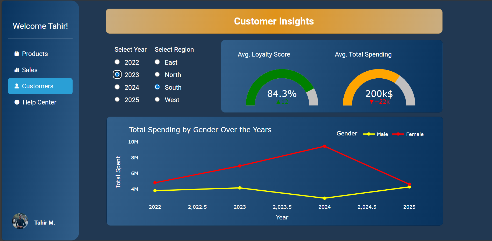

# 🧮 Multipage Business Dashboard (Python + Dash)

This project is a **multi-page business dashboard** built with Plotly Dash.
It allows users to visualize business data across multiple pages with interactive charts and tables.

## 📸 Preview
Here’s a quick preview of the dashboard:

## 🚀 Features
- Multi-page navigation (Products, Sales, Customers, Help Center, etc.)
- Interactive data visualizations using Plotly
- Integrated with Bootstrap theme for a modern UI
- Deployed on [PythonAnywhere]

## 🛠️ Tech Stack
- **Python**
- **Dash / Plotly**
- **Dash Bootstrap Components**
- **Pandas**

Tahir Mehmood
📍 BS Data Science | UMT Lahore
📧 tahir.dsofficial@gmail.com
